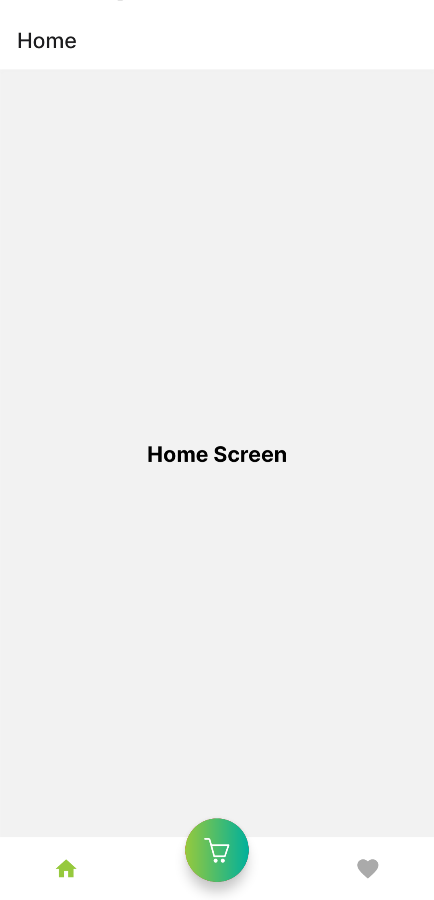
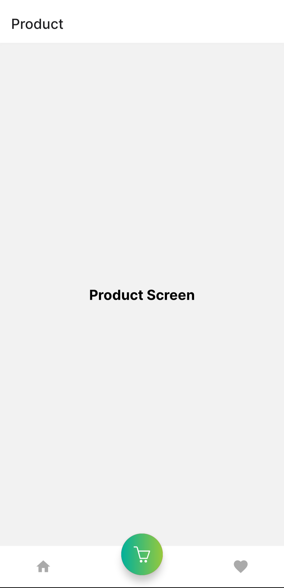
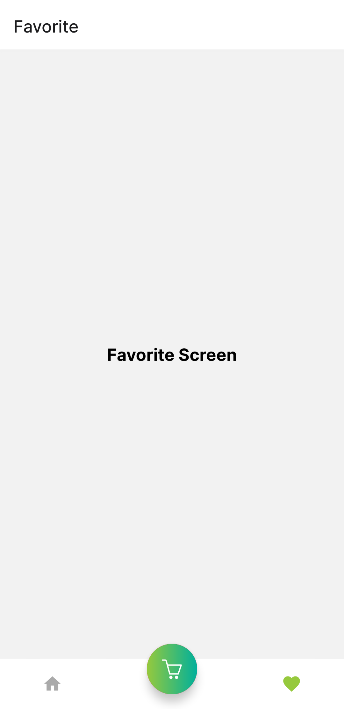

# custom-navigator

A custom tab navigator for React Native Apps (Build upon Expo).

## Installation

Clone custom-navigator with git

```bash
  git clone https://github.com/aaaravv/custom-navigator.git && \
  cd custom-navigator
```

Install necessary dependencies

```bash
  npm install
```

## Deployment

To deploy custom-navigator to your app, you need to add the following code to your app's root component.

```js
import React from "react";
import { createBottomTabNavigator } from "@react-navigation/bottom-tabs";
import { NavigationContainer } from "@react-navigation/native";

import Screen1 from "./app/screens/Screen1";
import Screen2 from "./app/screens/Screen2";
import Screen3 from "./app/screens/Screen3";
import TabBar from "./app/components/navigation/TabBar.js";

const Tab = createBottomTabNavigator();

const TabNavigator = () => {
	return (
		<Tab.Navigator tabBar={(props) => <TabBar {...props} />}>
			<Tab.Screen name="Home" component={Screen1} />
			<Tab.Screen name="Product" component={Screen2} />
			<Tab.Screen name="Favorite" component={Screen3} />
		</Tab.Navigator>
	);
};

export default function App() {
	return (
		<NavigationContainer>
			<TabNavigator />
		</NavigationContainer>
	);
}
```

Finally run the server with

```bash
  expo start
```

## Screenshots

<div align='center'>



</div>
